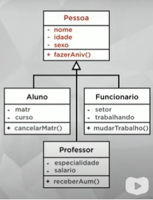

# Programação Orientada a Objetos em JAVA

## Objeto
O que é um objeto?
> Coisa Material ou abstrata que pode ser percebida pelos sentidos e descrita por meio das suas características, comportamentos e estado atual.
[Curso em Vídeo - POO em JAVA] 
>
Um objeto tem **características**, **comportamentos** e um **estado**.

Exemplos:
+ carro
+ controle remoto
+ celular

[mas também:]
+ horário 
+ data
+ compromisso

Exemplo do objeto caneta:
+ coisa material
+ pode ser percebida pelos sentidos
+ pode ser descrita e classificada por características, comportamentos e estado.
+ pode ter vários tipos de caneta, todas com a mesma forma, mesma classificação - mesma **classe**

A caneta é um **objeto**
A **classe** caneta é o molde da(s) caneta(s).

Classes - 3 perguntas:
1. **ATRIBUTOS**. Que coisas eu tenho?
    + modelo
    + cor
    + ponta
    + carga
    + tampada
2. **MÉTODOS**.
Que coisas eu faço?  
    + escrever
    + rabiscar
    + pintar
    + tampar
3. **ESTADO**. Como eu estou agora?
    + 50% de carga
    + ponta fina
    + destampada
    + escrevendo

Todo **objeto** surge a partir de uma **classe**.

**Instanciar**:
Criar um objeto a partir de uma classe. Quando se cria um objeto, cria-se uma instância de uma classe.
O `new` de um comando indica a instância de classe se efetivando.
Exemplo:
>
` Carro carro1 = new Carro("Fiat", "Ka", 2022);`

Ou seja:  
`Carro carro1`: Declara uma variável do tipo Carro.  
-  O objeto ainda nao está criado  

`= new Carro("Toyota", "Corolla", 2022);`: Inicializa a variável carro1 com um novo objeto Carro.
- Instancia de classe + método construtor
- Essta instância é então atribuída a variável *carro1*

Definição formal:
**CLASSE:**
> Define os atributos e métodos *comuns* que serão compartilhados por um objeto.
> 

**OBJETO:**
> É a instância de uma classe.
> 

## ABSTRAÇÃO
(Alguns autores consideram como um dos pilares da POO)
> Selecionar (abstrair) os atributos *mais importantes* para a uma determinada situação. "O que me importa neste momento?". Exemplo: não importa o peso de um aluno para um cadastro escolar; porém esta informação é necessária para um exame médico, ou para um teste de modelo.
>

## O que é visibilidade em um Objeto?  
Indicam o nível de acesso aos componentes internos de uma classe. Representados por: + (público), - (privado) e  #(protegido).

Definições:   
+ \+ **público**: a classe atual e todas as outras classes podem acessar; 
+ \- **privado**: somente a classe atual tem acesso;
+ \# **protegido**: dá acesso a classe atual e todas as suas sub-classes.    <sub>Quem pode acessar? "Só minha mãe e os filhos dela". Obs.: será importante no tópico herança.</sub>

## Métodos Especiais
+ Métodos Acessores (**Getters**): get = pegar/acessar;
+ Métodos Modificadores (**Setters**): set = modificar. Recebe um valor para modificar;
+ Métodos Construtores (**Construct**): cria um objeto já configurando-o previamente no momento da criação;

No **NetBeans** para criar esses métodos pressionar o atalho ctrl + i e selecionar os métodos.

## Encapsulamento

>**Encapsulamento**:
ocultar partes independente da implementação, permitindo construir partes invisíveis ao mundo exterior.
> 

+ um dos pilares da P.O.O.;
+ uma forma de proteção;
+ é possível trocar mensagens com a cápsula;
+ relação com a visibilidade de um objeto;
>**importante:** encapsular **não é obrigatório**, mas é uma boa prática para produzir Classes mais eficientes.
>
Vantagens de encapsular:
1)  Tornar mudanças invisíveis;   
2)  Facilitar a reutilização do código;   
3) Reduzir efeitos colaterais.

Como encapsular?   
1) Tornar os atributos privados (representados na linguagem UML por - antes do atributo);


## Interface
>**Interface**: Lista de serviços fornecidos por um componente. É o contato com o mundo exterior, que define o que pode ser feito com um objeto dessa classe. *Obs.: uma interface não tem atributos, só tem métodos. Estes métodos são considerados métodos abstratos.*
> 

## Herança
> Permite basear uma nova classe na definição de uma outra classe previamente existente. A herança será aplicada tanto para as características quanto para os comportamentos.
> 



## Relacionamento entre as classes


## Comandos em Java:

`this` é uma referência ao objeto que chamou.   
Ex.:   
Se o objeto c1 do tipo Caneta  chamou o método c1.tampar(), o comando tampar vai ser executado na classe Caneta sendo chamado pelo objeto c1.
```java
public class Caneta{
    boolean tampada;

    void tampar(){
        this.tampada = false; // ou seja, no exemplo de c1 estará a referência ao objeto  -> c1.tampada();
    }
}
```
+ Random:   
```java
import java.util.Random;
(...)
Random aleatorio = new Random();
int numero = aleatorio.nextInt(3); // número aleatório 0, 1 ou 2
```


## Atalhos NetBeans

Para completar a estrutura do if/else:
Digitar ```ifelse``` e dar um TAB que o NetBeans completa.
Para completar a estrutura do System...println(): digitar `sout`+ TAB

## Convenções e boas práticas

**Classes** e **Interfaces** sempre começam com letra maiúscula.